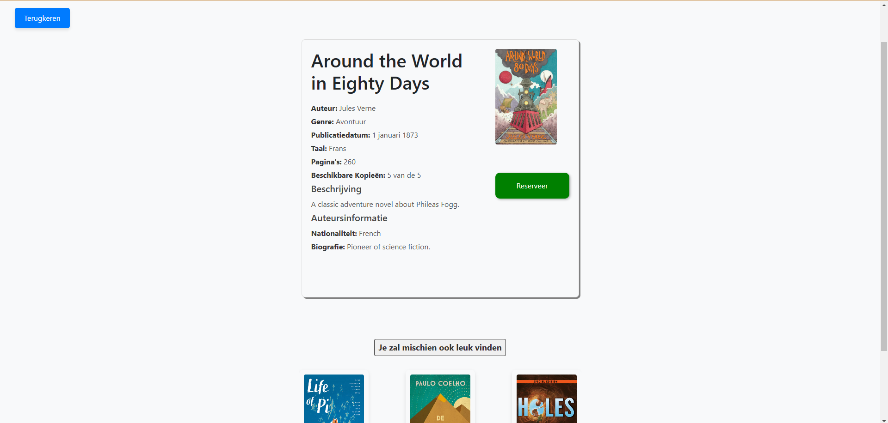
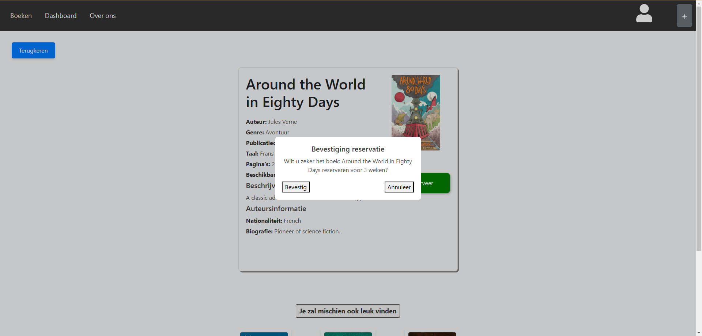
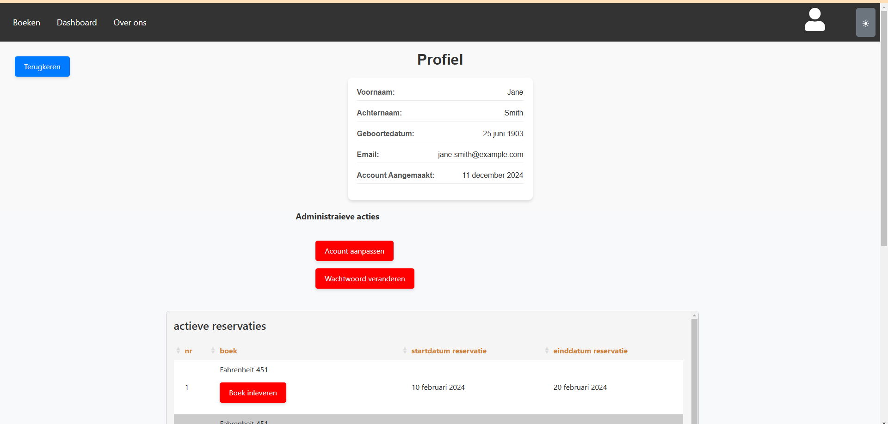
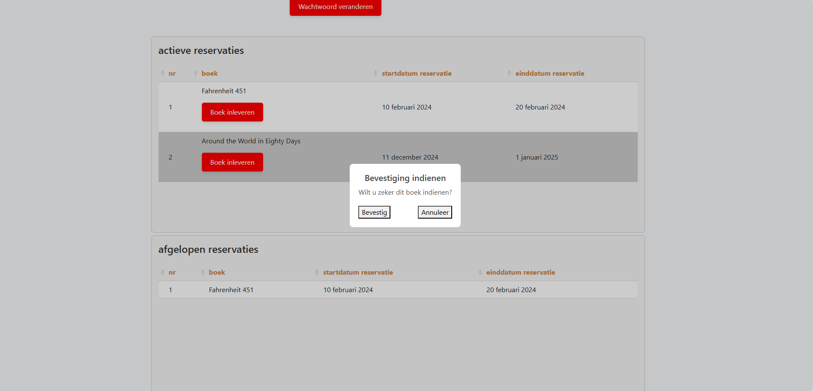
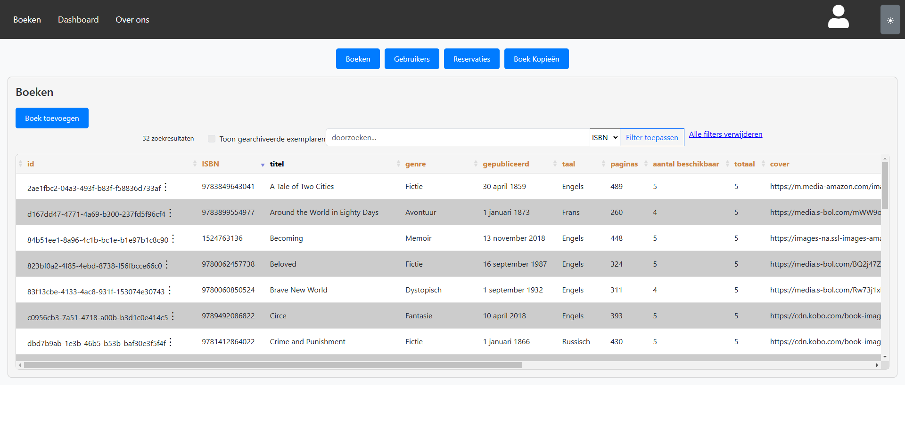
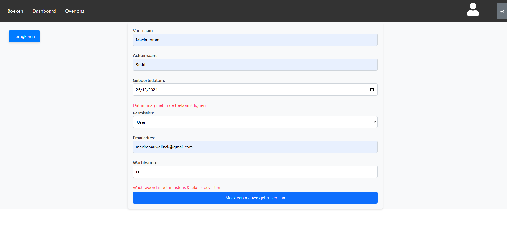
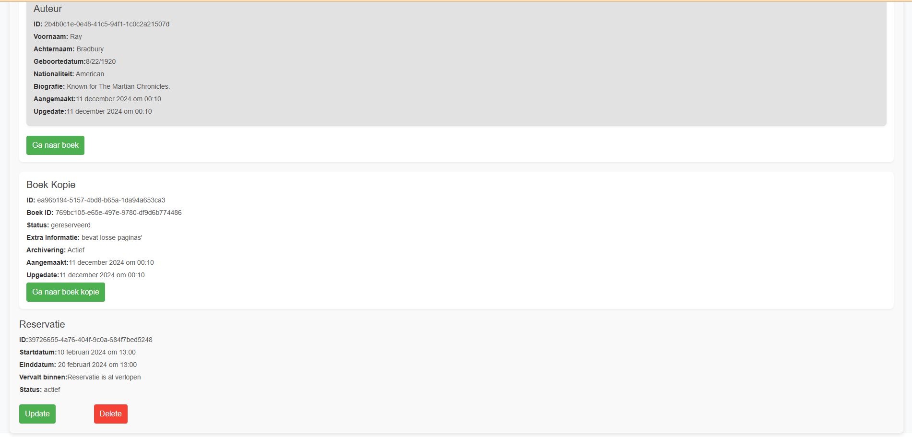

# Dossier

> Duid aan welke vakken je volgt en vermeld voor deze vakken de link naar jouw GitHub repository. In het geval je slechts één vak volgt, verwijder alle inhoud omtrent het andere vak uit dit document.
> Lees <https://github.com/adam-p/markdown-here/wiki/Markdown-Cheatsheet> om te weten hoe een Markdown-bestand opgemaakt moet worden.
> Verwijder alle instructies (lijnen die starten met >).

- Student: Maxim Bauwelinck
- Studentennummer: 302041mb
- E-mailadres: <mailto:voornaam.naam@student.hogent.be>
- Demo: <DEMO_LINK_HIER>
- GitHub-repository: https://github.com/HOGENT-frontendweb/frontendweb-2425-MaximBauwelinck1
- Front-end Web Development
  - Online versie: https://frontendweb-2425-maximbauwelinck1-1.onrender.com
- Web Services:
  - Online versie: https://frontendweb-2425-maximbauwelinck1.onrender.com

## Logingegevens

### Lokaal

deze gebruiker heeft als rol user
- e-mailadres: john.doe@example.com
- Wachtwoord: gebruiker1

deze gebruiker heeft als rol admin
- e-mailadres: jane.smith@example.com
- Wachtwoord: admin1

### Online

deze gebruiker heeft als rol user
- e-mailadres: john.doe@example.com
- Wachtwoord: gebruiker1

deze gebruiker heeft als rol admin
- e-mailadres: jane.smith@example.com
- Wachtwoord: admin1

## Projectbeschrijving

> Omschrijf hier duidelijk waarover jouw project gaat. Voeg een domeinmodel (of EERD) toe om jouw entiteiten te verduidelijken.

De applicatie is bedoelt voor een bibliotheek of andere instelling met veel boeken. Je kan hiermee als eerste gewoon de stock beheren van boeken(admin kant).
Daarnaast kan dit ook gebruikt om reservaties te beheren en plannen van deze boeken. Een gebruiker kan de boeken browsen en boeken reserveren. 

## Screenshots

## verloop user

## verloop admin

## API calls

> Maak hier een oplijsting van alle API cals in jouw applicatie. Groepeer dit per entiteit. Hieronder een voorbeeld.
> Dit is weinig zinvol indien je enkel Front-end Web Development volgt, verwijder dan deze sectie.
> Indien je als extra Swagger koos, dan voeg je hier een link toe naar jouw online documentatie. Swagger geeft nl. exact (en nog veel meer) wat je hieronder moet schrijven.

Zorg er zeker eerst voor dat de backend draait alvorens deze link proberen te bezoeken.
``http://localhost:9000/swagger``

## Behaalde minimumvereisten

> Duid per vak aan welke minimumvereisten je denkt behaald te hebben

### Front-end Web Development

#### Componenten

- [x] heeft meerdere componenten - dom & slim (naast login/register)
- [x] applicatie is voldoende complex
- [x] definieert constanten (variabelen, functies en componenten) buiten de component
- [x] minstens één form met meerdere velden met validatie (naast login/register)
- [x] login systeem

#### Routing

- [x] heeft minstens 2 pagina's (naast login/register)
- [x] routes worden afgeschermd met authenticatie en autorisatie

#### State management

- [x] meerdere API calls (naast login/register)
- [x] degelijke foutmeldingen indien API-call faalt
- [x] gebruikt useState enkel voor lokale state
- [x] gebruikt gepast state management voor globale state - indien van toepassing

#### Hooks

- [x] gebruikt de hooks op de juiste manier

#### Algemeen

- [x] een aantal niet-triviale én werkende e2e testen
- [ ] minstens één extra technologie
- [x] node_modules, .env, productiecredentials... werden niet gepushed op GitHub
- [x] maakt gebruik van de laatste ES-features (async/await, object destructuring, spread operator...)
- [ ] de applicatie start zonder problemen op gebruikmakend van de instructies in de README
- [x] de applicatie draait online
- [x] duidelijke en volledige README.md
- [x] er werden voldoende (kleine) commits gemaakt
- [x] volledig en tijdig ingediend dossier

### Web Services

#### Datalaag

- [x] voldoende complex en correct (meer dan één tabel (naast de user tabel), tabellen bevatten meerdere kolommen, 2 een-op-veel of veel-op-veel relaties)
- [x] één module beheert de connectie + connectie wordt gesloten bij sluiten server
- [x] heeft migraties - indien van toepassing
- [x] heeft seeds

#### Repositorylaag

- [x] definieert één repository per entiteit - indien van toepassing
- [x] mapt OO-rijke data naar relationele tabellen en vice versa - indien van toepassing
- [x] er worden kindrelaties opgevraagd (m.b.v. JOINs) - indien van toepassing

#### Servicelaag met een zekere complexiteit

- [x] bevat alle domeinlogica
- [x] er wordt gerelateerde data uit meerdere tabellen opgevraagd
- [x] bevat geen services voor entiteiten die geen zin hebben zonder hun ouder (bv. tussentabellen)
- [x] bevat geen SQL-queries of databank-gerelateerde code

#### REST-laag

- [x] meerdere routes met invoervalidatie
- [x] meerdere entiteiten met alle CRUD-operaties
- [x] degelijke foutboodschappen
- [x] volgt de conventies van een RESTful API
- [x] bevat geen domeinlogica
- [x] geen API calls voor entiteiten die geen zin hebben zonder hun ouder (bv. tussentabellen)
- [x] degelijke autorisatie/authenticatie op alle routes

#### Algemeen

- [x] er is een minimum aan logging en configuratie voorzien
- [ ] een aantal niet-triviale én werkende integratietesten (min. 1 entiteit in REST-laag >= 90% coverage, naast de user testen)
- [x] node_modules, .env, productiecredentials... werden niet gepushed op GitHub
- [x] minstens één extra technologie die we niet gezien hebben in de les
- [x] maakt gebruik van de laatste ES-features (async/await, object destructuring, spread operator...)
- [ ] de applicatie start zonder problemen op gebruikmakend van de instructies in de README
- [x] de API draait online
- [x] duidelijke en volledige README.md
- [x] er werden voldoende (kleine) commits gemaakt
- [x] volledig en tijdig ingediend dossier

## Projectstructuur

### Front-end Web Development

> Hoe heb je jouw applicatie gestructureerd (mappen, design patterns, hiërarchie van componenten, state...)?

### Web Services

> Hoe heb je jouw applicatie gestructureerd (mappen, design patterns...)?

## Extra technologie

### Front-end Web Development

> Wat is de extra technologie? Hoe werkt het? Voeg een link naar het npm package toe!

### Web Services

> Wat is de extra technologie? Hoe werkt het? Voeg een link naar het npm package toe!

## Gekende bugs

### Front-end Web Development

> Zijn er gekende bugs?

### Web Services

> Zijn er gekende bugs?

## Reflectie

> Wat vond je van dit project? Wat heb je geleerd? Wat zou je anders doen? Wat vond je goed? Wat vond je minder goed?
> Wat zou je aanpassen aan de cursus? Wat zou je behouden? Wat zou je toevoegen?
